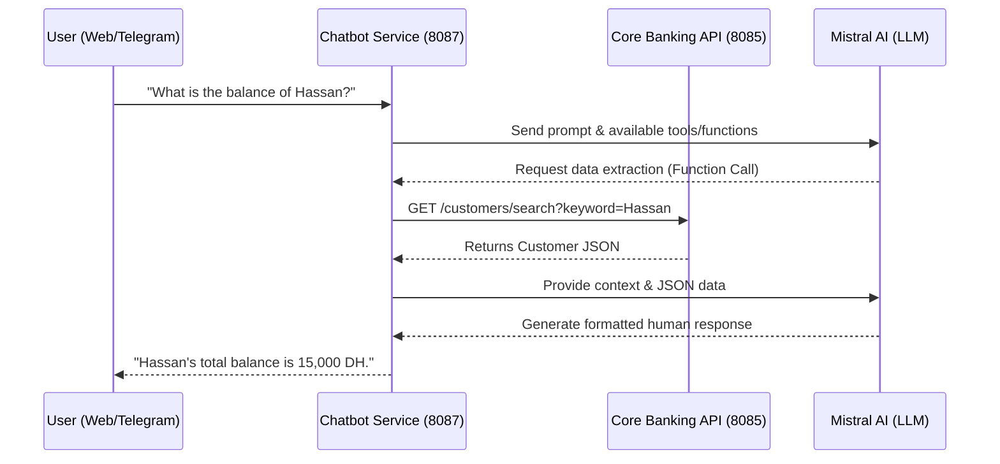

# 🤖 Digital Banking Chatbot (Spring AI & Mistral)

<div align="center">

[](https://spring.io/)
[](https://mistral.ai/)
[](https://core.telegram.org/bots)

**The intelligent core of the Digital Banking Ecosystem. This microservice connects natural language processing (NLP) to your banking backend.**
</div>

---

## 🌟 Overview

The `Chat-bot` module acts as an intelligent agent. Powered by **Mistral AI** and **Spring AI**, it understands natural language queries, fetches live financial data from the Core Banking API, and delivers formatted responses directly to users via **Telegram** and the **Angular Web Interface**.

---

## ⚙️ How It Works (Architecture)



---

## 🚀 Features

- **Omnichannel Access**: Fully integrated with the Angular UI via Server-Sent Events (SSE) and Telegram via Long Polling.
- **Function Calling**: Automatically maps user intent to internal backend APIs (e.g., fetching account history, searching customers).
- **Direct Commands**: Built-in slash commands for immediate data retrieval without LLM latency.
- **Multi-lingual Context**: Capable of understanding and responding in French, English, and other languages.

### 💬 Available Direct Commands
You can bypass natural language and directly use these commands in Telegram or the Web chat:
- `/accounts` — List all registered accounts.
- `/account <id>` — Show detailed metrics for a specific account.
- `/history <id>` — Retrieve the most recent operations for an account.
- `/customers` — List all customers in the directory.
- `/help` — Display the command guide.

---

## 🛠️ Setup & Installation

### 1. Environment Configuration
The application relies on an `.env` file to keep your API keys secure. 

Duplicate the example file and configure your keys:
```bash
cp .env.example .env
```

Edit the `.env` file with your credentials:
```properties
MISTRAL_API_KEY=your_mistral_api_key_here
TELEGRAM_API_KEY=your_telegram_bot_token_here
TELEGRAM_BOT_USERNAME=your_bot_username
BACKEND_API_BASE_URL=http://localhost:8085
```

### 2. Running the Service
Ensure your **Core Banking Backend** (`localhost:8085`) is already running. Then, start the Chatbot service:

```bash
# Windows
./mvnw.cmd spring-boot:run

# macOS / Linux
./mvnw spring-boot:run
```

The service will start on **port `8087`**.

### 3. Verification
- **Console Logs**: Look for `Started ChatBotApplication` and confirmation that the Telegram Long Polling bot has registered successfully.
- **Testing**: Open your Telegram app, search for your Bot Username, and type `/help` or *"Hello"*.

---

## 🔐 Security Notes
- The `.env` file is heavily `.gitignore`d to prevent accidental leakage of your Mistral and Telegram API keys.
- **Never commit your `.env` file to source control.**
- Ensure your Core Backend `SecurityConfig` allows the Chatbot to execute `GET` requests on `/accounts/**` and `/customers/**`.
