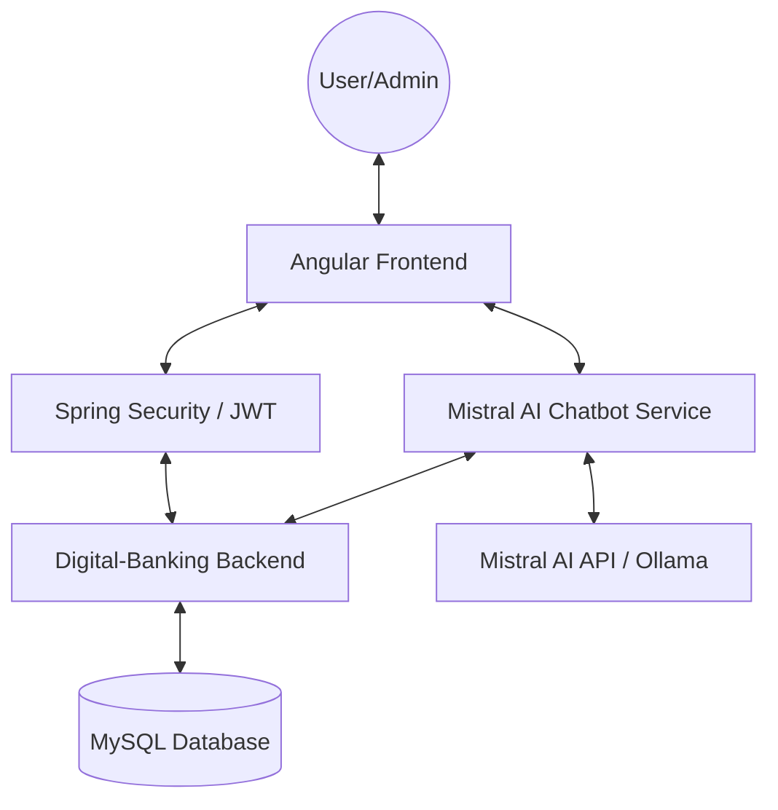
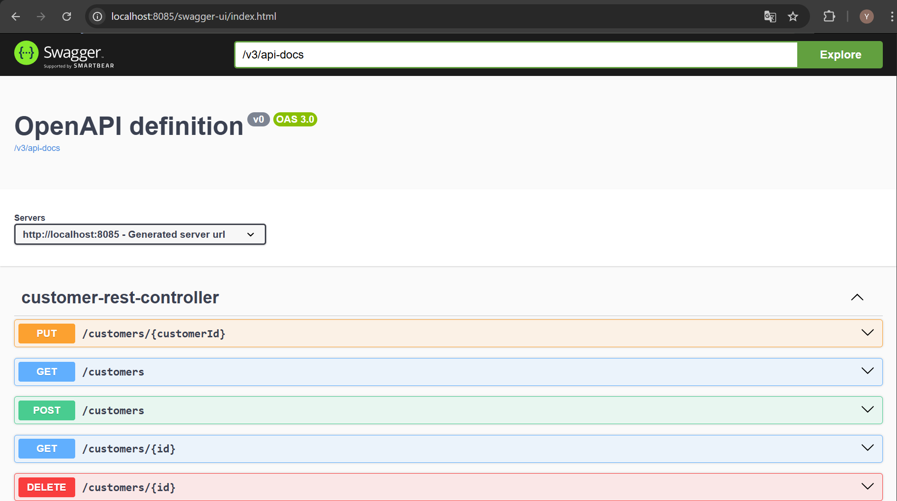
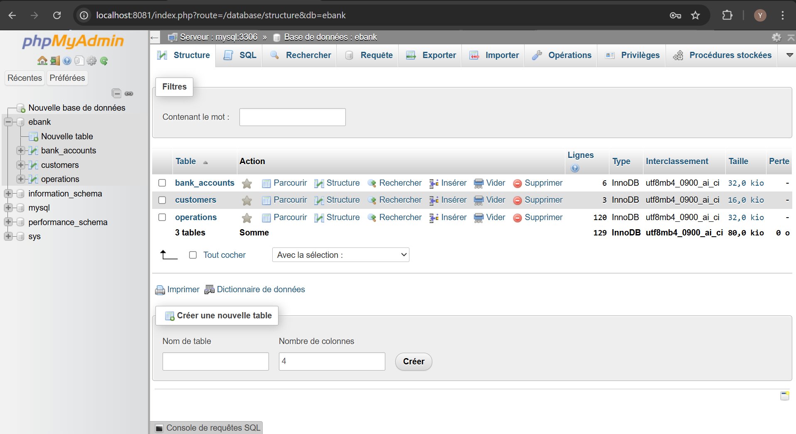

# 🏦 Digital Banking Ecosystem & Intelligent AI Agent

<div align="center">


[](https://spring.io/)
[](https://angular.io/)
[](https://mistral.ai/)
[](https://www.mysql.com/)

**An enterprise-grade financial management platform integrating generative AI, high-performance micro-services architecture, and real-time data visualization.**

[Explore Docs](http://localhost:8085/swagger-ui.html) • [Report Bug](https://github.com/yousseffalag/Digital-Banking-APP/issues) • [Request Feature](https://github.com/yousseffalag/Digital-Banking-APP/issues)

</div>

---

## 📖 Table of Contents
- [Project Overview](#-project-overview)
- [Key Features](#-key-features)
- [Architecture](#-architecture)
- [Visual Showcase](#-visual-showcase)
- [Tech Stack](#-tech-stack)
- [Installation](#-installation)
- [Security](#-security)
- [Author](#-author)

---

## 🌟 Project Overview

This project is a comprehensive **Digital Banking Solution** designed to modernize financial operations. It bridges the gap between traditional banking management and AI-driven insights. Whether it's managing customer lifecycles, executing complex inter-account transfers, or querying an AI about financial trends, this platform provides a unified, secure, and highly responsive experience.

---

## 🚀 Key Features

### 🏦 Core Banking Engine
- **Multi-Account Support**: Manage both **Current** (with overdraft) and **Saving** (with interest rates) accounts.
- **Transaction Engine**: Atomic **Credit, Debit, and Transfer** operations with full rollback protection.
- **Audit Trails**: Every operation records the authenticated user who performed it for maximum accountability.

### 🤖 Intelligent AI Assistant (The Brain)
- **Mistral AI Integration**: A smart agent that understands your banking database.
- **Natural Language Querying**: Ask *"Who is our top customer?"* or *"What is the balance of account X?"*.
- **Direct Commands**: Quick access via `/accounts`, `/customers`, and `/history`.

### 📊 Advanced Analytics Dashboard
- **Financial Visuals**: Dynamic charts showing account distribution and operation trends using **ChartJS**.
- **Real-time Statistics**: Instant visibility into total balances, customer growth, and system health.

---

## 🏗 Architecture



---

## 📸 Visual Showcase

<table border="0">
  <tr>
    <td><b align="center">📊 Real-time Dashboard</b><br></td>
    <td><b align="center">🤖 AI Assistant</b><br></td>
  </tr>
  <tr>
    <td><b align="center">🔐 Secure Login</b><br></td>
    <td><b align="center">🏧 Financial Operations</b><br></td>
  </tr>
</table>

---

## 🛠 Tech Stack

### Frontend
- **Framework**: Angular 16 (Reactive Architecture)
- **Styling**: Bootstrap 5 + Vanilla CSS (Premium Customization)
- **Charts**: ng2-charts (ChartJS)
- **Icons**: Bootstrap Icons / Lucide

### Backend
- **Core**: Spring Boot 3.2 (Java 17)
- **Security**: Spring Security + JWT (Stateless)
- **AI**: Spring AI (Mistral Integration)
- **Database**: Spring Data JPA + MySQL
- **Validation**: Lombok + Jakarta Validation

---

## ⚙️ Installation

### 1️⃣ Clone the Repository
```bash
git clone https://github.com/yousseffalag/Digital-Banking-APP.git
```

### 2️⃣ Database Configuration
Create a database named `ebank` in MySQL and update `backend/src/main/resources/application.properties`:
```properties
spring.datasource.url=jdbc:mysql://localhost:3306/ebank
spring.datasource.username=YOUR_USER
spring.datasource.password=YOUR_PASS
```

### 3️⃣ Start the Ecosystem
| Component | Directory | Command |
|-----------|-----------|---------|
| **Backend** | `/backend` | `mvn spring-boot:run` |
| **AI Bot** | `/Chat-bot` | `mvn spring-boot:run` |
| **Frontend** | `/frontend` | `npm install && ng serve` |

---

## 🔐 Security Model

The application implements a stateless **JWT (JSON Web Token)** security model:
- **Authentication**: Credentials-based login returning a signed JWT.
- **Authorization**: Role-Based Access Control (RBAC).
  - `USER`: Can view accounts and personal details.
  - `ADMIN`: Full access to Customer CRUD, Account creation, and Operations.
- **Protection**: CORS enabled, CSRF protection, and Bcrypt password hashing.

---

## 👤 Author

**Youssef Falag**
- 🌍 [GitHub Profile](https://github.com/yousseffalag)
- 💼 [LinkedIn](https://linkedin.com/in/youssef-falag)
- 📧 [Email](mailto:youssef.falag@example.com)

---
<div align="center">
  <sub>Built with passion for the Future of Banking 🏦✨</sub>
</div>
