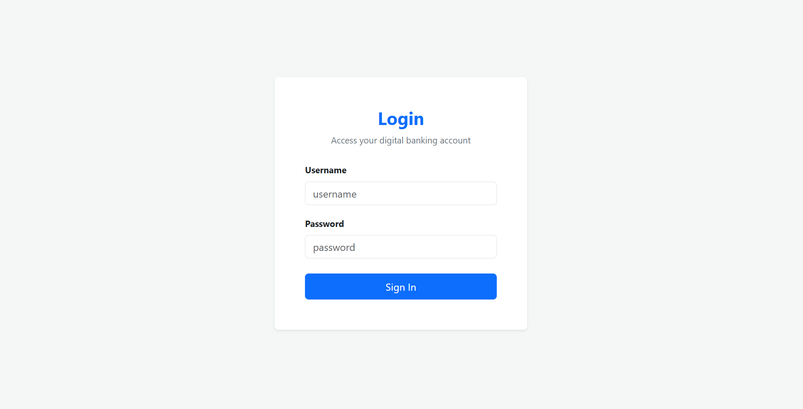
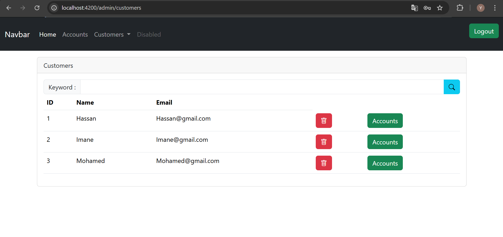
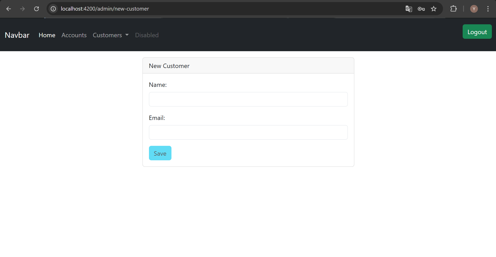
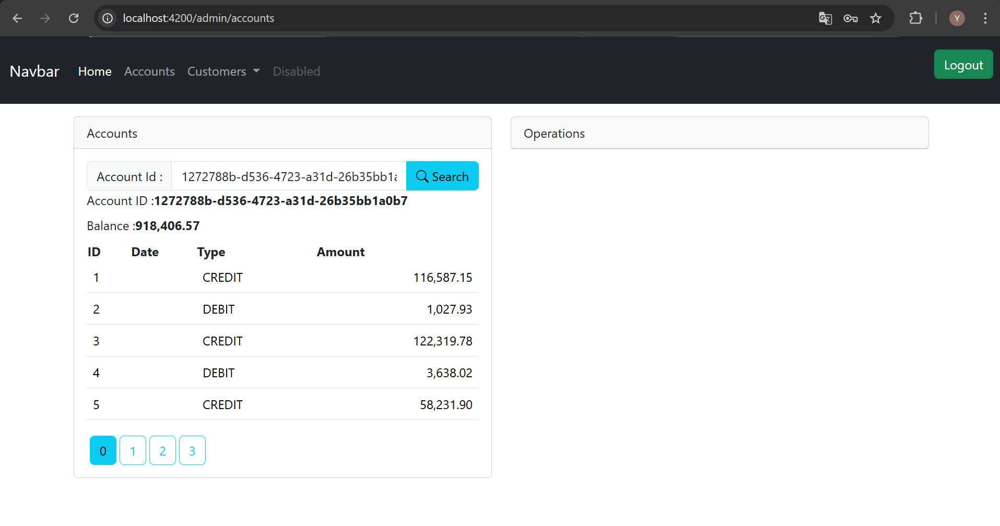
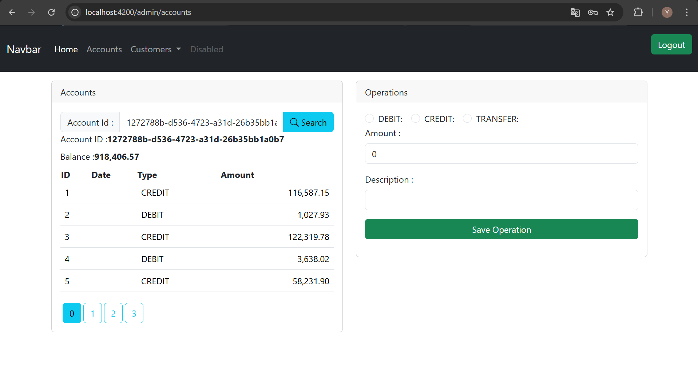

# 🏦 Digital Banking App

A full-stack digital banking administration platform built with **Spring Boot** (backend) and **Angular** (frontend). It allows admins to manage customers, bank accounts, and financial operations through a clean, responsive interface.

---

## 📸 Screenshots

| Login | Customers | New Customer |
|-------|-----------|--------------|
|  |  |  |

| Accounts & Operations | Operations Form |
|----------------------|-----------------|
|  |  |

---

## 🚀 Features

- 🔐 **Authentication** — Secure admin login with JWT (HS512) via Spring Security
- 👥 **Customer Management** — List, search, create, update, and delete customers
- 🏧 **Account Management** — Search accounts by UUID, view balance and paginated transaction history
- 💸 **Financial Operations** — Perform DEBIT, CREDIT, and TRANSFER operations
- 📄 **Swagger UI** — Interactive API documentation (OpenAPI 3.0)
- 🐳 **Docker** — MySQL + phpMyAdmin fully containerized

---

## 🛠️ Tech Stack

| Layer | Technology |
|-------|-----------|
| Backend | Java, Spring Boot, Spring Security, Spring Data JPA |
| Frontend | Angular, TypeScript, Bootstrap |
| Database | MySQL |
| API Docs | SpringDoc OpenAPI (Swagger UI) |
| Containerization | Docker, Docker Compose (DB only) |

---

## 📁 Project Structure

```
Digital-Banking-APP/
├── backend/
│   ├── src/main/java/org/example/
│   │   ├── dtos/           # Data Transfer Objects (CustomerDTO, BankAccountDTO, AccountHistoryDTO, AccountOperationDTO)
│   │   ├── entities/       # JPA Entities (Customer, BankAccount, Operation)
│   │   ├── enums/          # OperationType (DEBIT, CREDIT, TRANSFER), AccountStatus
│   │   ├── exceptions/     # Custom exceptions (CustomerNotFoundException, etc.)
│   │   ├── mappers/        # Entity <-> DTO mappers
│   │   ├── repositories/   # Spring Data JPA Repositories
│   │   ├── security/       # JWT config, SecurityConfig, SecurityController
│   │   ├── services/       # Business logic interfaces & implementations
│   │   └── web/            # REST Controllers (CustomerRestController, BankAccountRestApi)
│   ├── src/main/resources/
│   │   └── application.properties
│   ├── docker-compose.yml  # MySQL + phpMyAdmin only
│   ├── .dockerignore
│   └── pom.xml
├── frontend/
│   ├── src/app/
│   │   ├── components/
│   │   ├── services/
│   │   └── guards/
│   └── package.json
└── .gitignore
```

---

## 🗂️ Class Diagram

```
┌─────────────────────┐         ┌──────────────────────────┐
│      Customer        │  1    * │       BankAccount         │
│─────────────────────│ ───────▶│──────────────────────────│
│ id : Long           │         │ id : String (UUID)        │
│ name : String       │         │ balance : double          │
│ email : String      │         │ status : AccountStatus    │
│ bankAccounts : List │         │ customer : Customer       │
└─────────────────────┘         └──────────────────────────┘
                                          │ 1
                                          │
                                          ▼ *
                                ┌──────────────────────────┐
                                │        Operation          │
                                │──────────────────────────│
                                │ id : Long                 │
                                │ operationDate : Date      │
                                │ amount : double           │
                                │ type : OperationType      │
                                │ bankAccount : BankAccount │
                                └──────────────────────────┘

Enums:
  OperationType  → DEBIT | CREDIT | TRANSFER
  AccountStatus  → CREATED | ACTIVATED

DTOs:
  CustomerDTO, BankAccountDTO, AccountHistoryDTO, AccountOperationDTO
```

---

## ⚙️ Getting Started

### Prerequisites

- Java 17+
- Node.js 18+ & npm
- Maven
- Docker & Docker Compose

---

### 🐳 Step 1 — Start the Database (Docker)

The `docker-compose.yml` in the `backend/` folder runs **MySQL** and **phpMyAdmin** only. The Spring Boot app runs locally via Maven.

```bash
# Clone the repository
git clone https://github.com/yousseffalag/Digital-Banking-APP.git
cd Digital-Banking-APP/backend

# Start MySQL + phpMyAdmin containers
docker compose up -d
```

This spins up:

| Service | URL | Credentials |
|---------|-----|-------------|
| MySQL | `localhost:3306` | user: `root`, db: `ebank` |
| phpMyAdmin | `http://localhost:8081` | user: `root` |

To stop the containers:

```bash
docker compose down
```

To view container logs:

```bash
docker compose logs -f
```

---

### 🔧 Step 2 — Run the Backend

```bash
# Still inside the backend/ directory
mvn spring-boot:run
```

The backend starts at → **`http://localhost:8085`**

Make sure `application.properties` matches your Docker DB config:

```properties
server.port=8085

spring.datasource.url=jdbc:mysql://localhost:3306/ebank
spring.datasource.username=root
spring.datasource.password=
spring.jpa.hibernate.ddl-auto=update

jwt.secretKey=YOUR_SECRET_KEY_MIN_32_CHARS
```

---

### 🌐 Step 3 — Run the Frontend

```bash
cd ../frontend
npm install
ng serve
```

Frontend starts at → **`http://localhost:4200`**

---

## 🔑 Credentials (In-Memory)

Defined in `SecurityConfig.java`:

| Username | Password | Role |
|----------|----------|------|
| Ussef | 1234 | USER |
| Achraf | 1234 | USER, ADMIN |

---

## 📖 Swagger API Documentation

Once the backend is running, open:

```
http://localhost:8085/swagger-ui/index.html
```

Raw OpenAPI spec:

```
http://localhost:8085/v3/api-docs
```

### API Endpoints

#### `security-controller`

| Method | Endpoint | Description |
|--------|----------|-------------|
| POST | `/auth/login` | Authenticate and get JWT token |
| GET | `/auth/profile` | Get current authenticated user profile |

#### `customer-rest-controller`

| Method | Endpoint | Description |
|--------|----------|-------------|
| GET | `/customers` | List all customers (supports keyword search) |
| GET | `/customers/{id}` | Get customer by ID |
| POST | `/customers` | Create a new customer |
| PUT | `/customers/{customerId}` | Update an existing customer |
| DELETE | `/customers/{id}` | Delete a customer |

#### `bank-account-rest-api`

| Method | Endpoint | Description |
|--------|----------|-------------|
| GET | `/accounts` | List all bank accounts |
| GET | `/accounts/{accountId}` | Get account by ID |
| GET | `/accounts/{accountId}/operations` | Get all operations for an account |
| GET | `/accounts/{accountId}/pageOperations` | Get paginated operations for an account |

### Schemas

| Schema | Description |
|--------|-------------|
| `CustomerDTO` | Customer data transfer object |
| `BankAccountDTO` | Bank account data transfer object |
| `AccountHistoryDTO` | Paginated account history with balance |
| `AccountOperationDTO` | Individual operation detail |

### Enabling Swagger (SpringDoc)

Add to `pom.xml`:

```xml
<dependency>
    <groupId>org.springdoc</groupId>
    <artifactId>springdoc-openapi-starter-webmvc-ui</artifactId>
    <version>2.3.0</version>
</dependency>
```

Add to `application.properties`:

```properties
springdoc.api-docs.path=/v3/api-docs
springdoc.swagger-ui.path=/swagger-ui.html
```

Permit Swagger routes in `SecurityConfig.java`:

```java
.authorizeHttpRequests(ar -> ar.requestMatchers(
        "/auth/login/**",
        "/v3/api-docs/**",
        "/swagger-ui/**",
        "/swagger-ui.html"
).permitAll())
.authorizeHttpRequests(ar -> ar.anyRequest().authenticated())
```

---

## 🗺️ Application Routes

| Route | Description |
|-------|-------------|
| `/login` | Admin authentication |
| `/admin/customers` | List & manage customers |
| `/admin/new-customer` | Create a new customer |
| `/admin/accounts` | Search accounts & perform operations |

---

## 📄 License

This project is open-source and available under the [MIT License](LICENSE).

---

## 👤 Author

**Youssef Falag**
GitHub: [@yousseffalag](https://github.com/yousseffalag)
